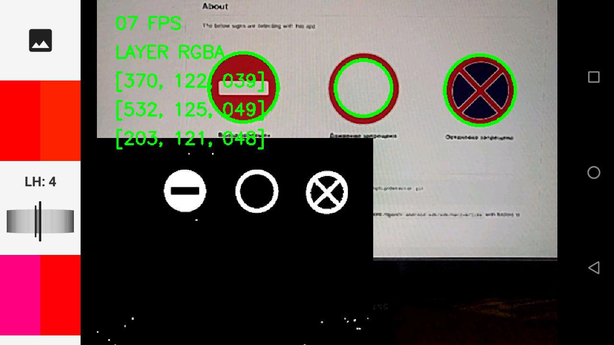

# ProhibitingSignDetector

  

Simple detector for phohibiting traffic signs in Android

Article https://habrahabr.ru/post/339506/

## Binaries

[Download apks for arm64-v8a, armeabi, armeabi-v7a, mips or x86](https://github.com/androidovshchik/ProhibitingSignDetector/releases)

## Example

The below signs are detecting with this app

## Getting started

    $ git clone https://github.com/androidovshchik/ProhibitingSignDetector.git
    $ cd ProhibitingSignDetector

[Download OpenCV 3.2 Android SDK](https://sourceforge.net/projects/opencvlibrary/files/opencv-android/3.2.0/opencv-3.2.0-android-sdk.zip/download)

Extract `opencv-3.2.0-android-sdk.zip` to home directory e.g.

Copy *.so files for your supported platforms from `$HOME/OpenCV-android-sdk/sdk/native/libs` with its folders to `ProhibitingSignDetector/app/src/main/jniLibs`

*Impotant!*

*The path for included files in Cmake `include_directories(~/OpenCV-android-sdk/sdk/native/jni/include)` must begin with the same*

Below command for Linux may be helpful:

    $ cd app/src/main/jniLibs
    $ cp -R ~/OpenCV-android-sdk/sdk/native/libs/* ./
    $ find . -name "*.a" -type f -delete

You are done. Setup Android SDK with NDK and build apk

## License

